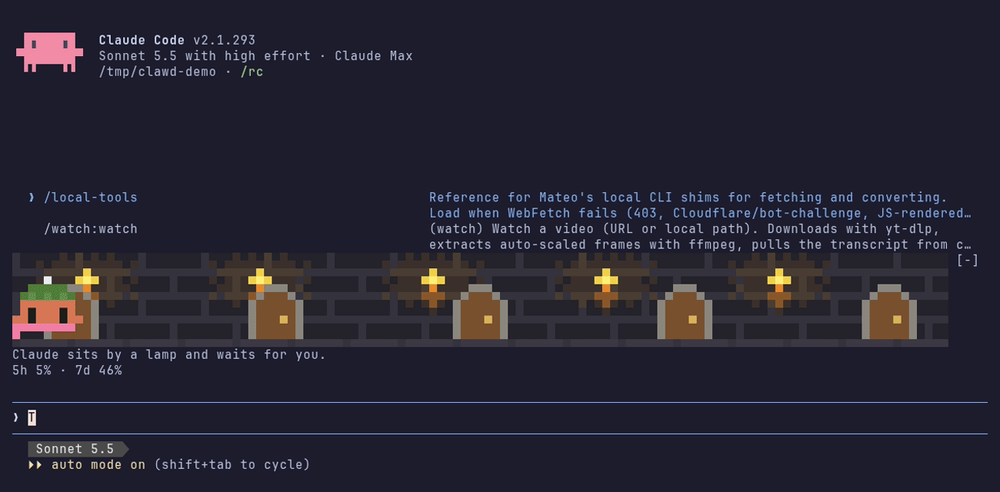

# clawd-tales

A pixel Clawd that acts out what Claude Code is doing, in a band above your prompt.

[Claude Fables](https://github.com/henrik-thevibe/Claude-Fables) draws a model-written cartoon of your session in the desktop app. clawd-tales does it in the terminal from templates, so it costs no tokens.



*The 45-second `/tales demo`: Clawd hatches, helpers walk in, tests fail and bugs drop, Claude calls for you, a storm rolls in, and Clawd grows up.*

Glance down and you know what Claude is doing. A red `!` and a jumping Clawd means it is waiting on you. Rain means the context is nearly full.

Every tool call gets a pose and a one-line caption. Claude reads a book for `Read`, digs for `Edit`, sneaks for `Grep`, runs for `Bash`, flies for web search. Subagents walk in as their own critters, colored by model.

### A minute in the band

You ask Claude to fix a failing test. Clawd runs off to `pytest` and three bugs drop onto the ground. It reads the test file with a book open, then digs into the code. A red `!` appears and Clawd jumps: Claude wants to run a command. You approve within a few seconds, and Clawd beams with hearts. The tests go green, Clawd eats all three bugs, and a turn that long ends in a dance.

## What it shows

| Happening in Claude Code | In the band |
|---|---|
| A tool call | Clawd's pose and a caption naming the file, pattern or command |
| A subagent starts | A helper walks in: purple for Opus, teal for Sonnet, green for Haiku, gold for Fable |
| A subagent finishes | It runs back to Clawd and they cheer, with hearts |
| A permission dialog opens | Clawd jumps next to a red `!` and the caption turns red |
| A test run fails | Bugs drop onto the ground, one per failing test (up to 8) |
| The tests go green | Clawd eats the bugs |
| A todo list | Pending items sit on the ground as pellets. Finishing one is a gobble |
| Context fills up | Clouds at 50%, rain and an umbrella at 70%, lightning at 85% |
| The turn ends | A nod if it took under 4 seconds, a hop up to a minute, a dance up to five, and past that a flag planted at the summit. Then Clawd sits, yawns and falls asleep. The band hides after 3 minutes; your next prompt wakes Clawd, and a new helper brings the band back |
| A plan limit hits 100% | Clawd sleeps until the reset time. A minute before, it stretches, and once the limit resets it's up |
| Claude waits on a subagent | Clawd puts on headphones. With two or more out, it juggles one ball per helper, each in that helper's color |
| Three or more subagents out | Clawd wears a tie. It's the boss now |
| An MCP tool call | A ring of color spreads from Clawd. Each server gets its own color |
| Every 50K tokens | Confetti, and the count in the turn's last caption |
| Claude thinks for a while between tool calls | A thought bubble fills in over the pose it is holding |
| Five clean tool calls in a row | A combo counter. At ten, Clawd wears a crown |
| A subagent fails | It trips, then walks back to Clawd for a pat on the head |
| Four or more subagents out at once | The idle ones walk in a line behind the first one |
| Two errors in a row | Clawd goes cross-eyed with stars circling. A third flips the table |
| You approve a permission prompt quickly | Hearts. Leave one waiting past 30 seconds and Clawd starts to sweat, with a timer in the caption |
| The conversation is compacted | Clawd sweeps the stage with a broom and the weather clears |
| A session starts | Clawd drops in from the sky. A resumed session gets a wave hello. The first new session after you install hatches Clawd from an egg, and progress starts counting from there |
| 200 tool calls | The hatchling loses its eggshell cap and grows up into whatever work it did most: a scholar (reading), a detective (searching), a builder (editing), a hacker (commands), an explorer (the web) or a captain (helpers). Each wears its own hat, and the form can change as your habits do |

### Small things

- Thank Claude in your prompt and Clawd blushes with heart eyes. Start with "no" or "wrong" and it rubs its head, brows up, and can't look you in the eye.
- Clawd dresses for the job: a wizard hat in plan mode, a hard hat two minutes into a long turn, and shades for the rest of a turn once it has earned the crown.
- `git commit` wraps a parcel and pops confetti. `git push` sends a paper plane off the stage. `rm -rf` makes Clawd cover its eyes. Package installs drop boxes from the sky.
- A command that isn't found sends the `sl` train across the stage.
- While it waits for you, Clawd waves, winks, scratches its head, looks around and watches a butterfly. A longer wait and it goes fishing. Asleep, it dreams about the last thing it did.
- Clawd glances left and right now and then, and looks over when a helper walks in. Sitting, it breathes.
- The sky follows your clock: sun by day, stars at night. Between 1 and 5 am, Clawd wears a nightcap and keeps a mug of coffee nearby.
- Halloween, Christmas, New Year's, Valentine's Day and April 1st each get a costume or something extra.
- Now and then a whale, a UFO or the train passes through. One session in a hundred brings a shiny Clawd.

Under the caption, a status line shows `ctx 74% · 5h 22% · 7d 23%`, plus the todo count and a roster of the helpers. Numbers turn yellow at 80% and red at 95%.

The band shrinks with your terminal: the full band at 8 rows, no sky at 6, then a single line.

## Install

Needs a Claude Code build with mods (function hooks). Built and tested on 2.1.289; run `claude --version` to see yours. After installing, start a new session and type `/`: if `/tales` isn't in the list, the mod didn't load, and your build probably doesn't support mods yet.

```sh
claude plugin marketplace add plaxagoras/clawd-tales
claude plugin install clawd-tales@clawd-tales
```

Start a new session, then run `/tales demo`.

To try it for one session without installing:

```sh
git clone https://github.com/plaxagoras/clawd-tales
claude --plugin-dir ./clawd-tales
```

## Commands

| Command | What it does |
|---|---|
| `/tales demo` | Plays a short story: a hatching, helpers, bugs, pellets, weather, a permission call and growing up. Your own Clawd's progress isn't touched |
| `/tales calm` | One frame a second, and nobody wanders between tool calls |
| `/tales lively` | Back to 5 frames a second (the default) |
| `/tales off` / `/tales on` | Hide or show the band |
| `/tales` | Shows the current state |
| `/tales hat <name>` | Puts on a top hat, grad cap, captain's hat, wizard hat, hard hat, deerstalker, beanie, pith helmet or eggshell (`none` takes it off). Saved between sessions |
| `/tales face <name>` | Glasses, shades or a mustache (`none` takes them off). Saved between sessions |
| `/tales scarf on` / `off` | Each project gets its own scarf color, picked from the project folder, so you can tell repos apart. On by default |
| `/tales holiday <name>` | Previews a holiday look until the next restart (`auto` goes back to the calendar) |

Your on/off and calm settings are saved between sessions.

## How it works

It is a Claude Code mod: a plugin of function hooks in `hooks/register.tsx`. It listens to `tool.call`, `agent.spawn`, `classic.PermissionRequest`, `classic.UserPromptSubmit` (for plan mode), `session.measure` and the turn events, and draws with `ui.render` on the `AbovePrompt` band. Each terminal cell is two pixels (`▀` with a foreground and a background color).

- No network, no model calls. It only reads what the hooks hand it, and the only things it saves are your settings (on/off, calm, hat, face, scarf) and Clawd's tool-call tally in Claude Code's plugin store.
- Test results come from the `Bash` output of commands that look like test runs (`npm test`, `pytest`, `cargo test`, `go test` and similar).
- Subagent end is detected by polling `$.agent.list()`.

### Limits

- A test runner whose command isn't on the list never drops bugs.
- A helper's finish can show a second or so late (about 5 seconds in calm mode), because the end is polled.

## Add a pose

Poses are pixel rows in `sprite()` in `hooks/art.ts`. Which tool gets which pose and caption is `beat()` in `hooks/story.ts`. Run `claude --plugin-dir .` and your edits reload as you go; `claude plugin test .` runs the tests. Pull requests with a short GIF of the new pose are welcome.

## Credits

The walk and cheer frames and the base palette come from Claude Fables by henrik-thevibe (MIT). See `NOTICE`.

Clawd is Anthropic's mascot. This is an unofficial fan project, not affiliated with Anthropic.

## License

MIT
